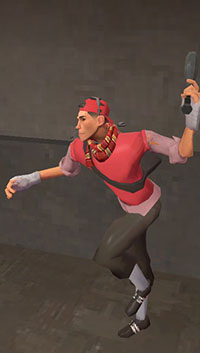

## Introduction ##

Fundamentals
============

------------------------------

Pocket Soldier
------------------------------

Roles:
* Coordinating and leading pushes
* Protecting medic
* Creating space for demo

Standard Loadout:
* Rocket launcher
* Shotgun
* Escape Plan

The pocket soldier leads the combo and guides the flank to safe engagements. This soldier
role typically prioritizes the medic's life, saving him from immediate threats as quickly 
as possible, thus 'pocketing' the medic. 

Pocket soldier is a relatively easy role to master due to the generous amount of heals and buffs
that come with protecting the medic. Most pockets run shotgun as their secondary item since they 
usually don't stray too far from the medic.

Good pocketing habits
---------------------

1.  *Always count uber*

    Since the pocket is attached to the medic at the hip, you should always know which team will
    get ubercharge first. Constantly communicate this to your team so they can react accordingly.
    If you have a massive advantage, make sure everyone is buffed and ready to push as soon as the
    meter hits 100%. If you sit on an uber advantage wasting time healing up players or getting in
    positioning, your window of opportunity will shrink because enemy team *will* get uber eventually.

    Instead, organize pushes well in advance. A good time to buff is around 85% uber charge
    assuming everyone can be topped off with a buff. That way, by the time the medic approaches 100%, 
    everyone is ready to push with a fat health buff.

    Count how much the advantage/disadvantage is by percentage or by time. Rougly guess what the advantage
    is in game and review a demo later to see the actual difference.

    > We have 40% advantage! Let's get ready to push from main in 20 seconds

2.  *Always clear sticky traps and hiding spots*
    
    After clearing an area and moving through doorways and choke points, the pocket should ALWAYS give
    an 'all clear' to the medic. Nearly all sticky traps and hiding spots can be cleared with diligent 
    rocket spam.

    Through experience, clearing traps will become second-nature but for newcomers, if your medic
    goes down from a trap or hiding spot, make sure it doesn't happen again. As a general rule,
    these sort of medic deaths are the pocket's fault so minimize them when you can. Trust is important
    in team games and wandering aimlessly through doorways will confuse your medic especially if he is
    waiting for you to clear a passage. Don't leave him hanging.

    > Fool me once, shame on you
    >
    > Fool me twice, shame on me!

3.  *Talk to your medic*

    Communication with your medic is vital as a pocket! Always talk to your medic, because he can't
    read your mind. Sometimes you need to use uber in order to close gaps, sometimes you can slowly
    edge in without using uber. In any case, the medic will need to know when to milk ubers and when 
    to 'pop it'.

    Let the medic know when you need to be followed or when to fall back. The other side of a wall 
    could be stacked with enemy players or completely empty. 
 
4. *Talk to your team*

   Narrate uber pushes. Are you forcing their medic to split uber? Are we splitting our own uber?
   Who's getting a better uber out of the exchange? Can the flank collapse on the enemy combo? Did 
   you clear traps for the flank to come in? Who do we focus fire? 

   Narrate holds and transitions. Where are we holding? Where is our combo? 

   Try answering these questions, hopefully without your team having to ask.
    

---------------

Roaming Soldier
---------------

* Distracts and splits attention
* Generates picks by element of surprise
* Roams freely by controlling health packs

---------------------------

Demo
---------------------------

* Highest damage output
* Area denial
* Controls height advantage

----------------------------

Scout
----------------------------

----------------------------

Medic
----------------------------

Team Mechanics
==============

------------------------------

Uber Advantage
------------------------------

-----------------------------

Number Advantage
-----------------------------

> create enormous pressure by forcing lop-sided team fights

When playing, always keep tabs on how many players are on the battlefield. Press tab often and call
team count vs enemy count. For example: calling "5v3" conveys that five of your team are alive 
while only three of your enemies are alive.

Considering numbers simplifies the game because you can simply overwhelm the other team if you have
more players up. When you have more players alive, you can create enormous pressure by forcing lop-sided
team fights. Even without uber, use expendable players like the roamers or scouts to make a 'play' 
either forcing their medic to use uber or to outright kill their medic.

As a general rule of thumb, having two players over the enemy team is an **automatic push**. Position your medic 
behind the front lines to keep him safe from suicide plays. Even if you drop players, you can still push
with confidence because the other team will be hurt and busy reloading. Don't let your teammates' deaths 
go to waste. Press number advantages asap.

Don't forget to factor in respawn times when making a push based on numbers. If you make a late push, you might
realize you are pushing into more than what you bargained for. Respawn times vary by map so ensure your pushes 
are made before the respawners have a chance to defend. 

When at a number disadvantage, play passively. Defend as much territory as you possibly can without 
committing deaths. It's extremely important not to bleed players one after another because your team might 
find itself constantly disadvantaged. Slow their team's advance, force uber, and take easy kills but try to stay
alive so that your team has a chance to fight back six players strong.

Leapfrogging
------------

Map Specific Guides
===================

cp_snakewater
----------

cp_granary
-------

cp_badlands
--------

